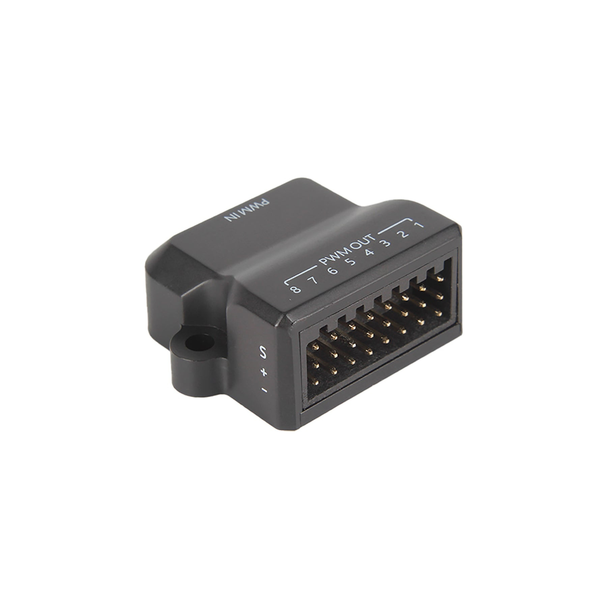

# Devlog #1 – Research & Initial Design

Link to the board where i drew the concept : https://app.idroo.com/boards/iBzdX5M0Z2
Drone General Design : Part 1 https://lapse.hackclub.com/timelapse/2bgpf7khk9ri

This project turned out to be much harder than I initially expected. At first, I thought designing a drone frame would mostly be about getting the dimensions right and fitting the electronics inside. Instead, almost every design choice affects several others. The frame layout determines the electronics placement, which changes the center of gravity, which then affects the battery location, cooling, cable routing and even manufacturing. I already know that I'll probably redesign a lot of things later, but for now I just need to make enough decisions to start modeling.

## Reference Frames

The first step was looking at existing drones that meet my requirements: a **10-inch(i'll test it later) quadcopter capable of carrying a companion computer and a depth camera while running on a 4–6S battery**.

After looking through different options, I decided to use the **Holybro X500 V2 / PX4 Vision Dev Kit V1.5** as my primary reference. I also looked at the iFlight Helion 10 and AOS UL10 V5, but the Holybro platform is much closer to what I want to build because it is designed for autonomous robotics rather than FPV racing.

Useful references:

* [https://docs.px4.io/main/en/frames_multicopter/holybro_x500v2_pixhawk6c](https://docs.px4.io/main/en/frames_multicopter/holybro_x500v2_pixhawk6c)
* [https://docs.px4.io/main/assets/payloads_x500v2.BlKS32-f.png](https://docs.px4.io/main/assets/payloads_x500v2.BlKS32-f.png)
* [https://ntu-aris.github.io/ntu_viral_dataset/images/hardware.jpg](https://ntu-aris.github.io/ntu_viral_dataset/images/hardware.jpg)
* [https://docs.px4.io/main/assets/hero_image.DGHv_vvL.png](https://docs.px4.io/main/assets/hero_image.DGHv_vvL.png)

The Holybro design also helped me understand how professional development drones package their electronics.

---

## Learning

Before opening Fusion 360, I need to spend more time understanding drone design itself. There are still many things I don't fully understand, such as frame stiffness, vibration isolation, power distribution, ESC placement and battery mounting. I'll also look into Fusion 360 drone design tutorials and see how other people organize their CAD assemblies.

---

## Initial Design Decisions

The drone will be a **10-inch X-configuration quadcopter**. I chose the X layout since it is the standard for autonomous drones and provides symmetrical flight characteristics. It will use a **Pixhawk 6X with the Holybro Jetson Baseboard**, meaning the flight controller and companion computer are designed to work together as one stack.

My goal isn't racing or flying through goggles—it's an autonomous robotics platform. If I use a depth camera such as an Intel RealSense or Luxonis OAK-D, I already get an RGB camera together with depth sensing, so I probably won't need a separate forward-facing camera unless I specifically decide to add an FPV system later.

The drone will also include a GPS, RC receiver, telemetry radio and probably a VTX, although I'm still deciding whether the latter is actually necessary.

---

## Mechanical Analysis

Before committing to the frame dimensions I want to perform at least some simple engineering calculations instead of relying purely on intuition.

The first will be a basic stress analysis on the arms to estimate whether the chosen carbon fiber thickness is sufficient. The second will be a simple drop test calculation to get an idea of the loads during rough landings or crashes. These won't be full finite element simulations, but they should provide enough confidence before manufacturing.

References:

[https://sites.bu.edu/uav/files/2017/11/Frames.pdf](https://sites.bu.edu/uav/files/2017/11/Frames.pdf)

[https://blog.uavmodel.com/how-to-design-and-3d-print-custom-drone-frames/](https://blog.uavmodel.com/how-to-design-and-3d-print-custom-drone-frames/)

---

## Material Selection

At the moment, carbon fiber is still the obvious choice. It offers the best stiffness-to-weight ratio and is the standard material used in almost every modern drone frame.

I probably won't cut the first prototype directly from carbon fiber though. A better workflow would be to prototype using cheaper materials first, verify that everything fits together and only then manufacture the final version from carbon fiber.

---

## Notes and Decisions

A standard **10-inch propeller has a diameter of 254 mm**, which gives a good starting point for estimating the wheelbase.

One thing I underestimated was the size of the onboard computer. While the Jetson module itself isn't huge, the complete **Pixhawk 6X + Holybro Jetson Baseboard + Orin NX with heatsink** measures approximately **126 × 80 × 39–45 mm**. That assembly alone almost determines the minimum size of the center frame.

After comparing different options, I decided to use **four separate ESCs** instead of a single 4-in-1 ESC. A 4-in-1 board would simplify wiring and save some weight, but separate ESCs are easier to replace if one fails, distribute heat better and seem more appropriate for a research platform where reliability is more important than saving a few grams. This also means the frame will need a dedicated power distribution board.

I also decided that the **arms should be sandwiched between the upper and lower carbon plates**. This is the strongest configuration, makes replacing an arm straightforward and is widely used on larger carbon fiber frames.

The components that actually generate significant electrical interference are the ESCs, switching regulators and high-current battery wiring, not the Jetson itself.

The current frame concept is a two-level design. The Jetson Baseboard, telemetry and receiver will be mounted on the upper deck, while the lower section will contain the power distribution board and four ESCs. The battery will be mounted underneath the frame to keep the top free for electronics, and the depth camera will sit at the very front. The GPS will most likely be placed on a mast at the rear to minimize interference.

At this point, I expect many of these decisions to change. Right now the goal isn't to create the perfect drone, but to make enough informed decisions that I can finally start modeling something in Fusion 360 instead of endlessly researching. I already have a feeling I'll end up redesigning large parts of the frame once I start fitting the real components together.

--------
Drone General Design : Part 2 https://lapse.hackclub.com/timelapse/HdxbJGZdj3zA

After doing more research on the required hardware, I created a second design concept and started placing the major components inside the frame at approximately their real dimensions. The goal wasn't to create an accurate CAD model yet, but rather to check whether everything could realistically fit inside the central body before starting the detailed design in Fusion 360.

The battery remains mounted underneath the frame, while the upper section is reserved for the Pixhawk 6X with the Jetson Baseboard, the IP radio, RC receiver, GPS/compass and other electronics. I also decided to use four separate ESCs instead of a single 4-in-1 ESC, placing them closer to the arms to reduce motor wire length and make them easier to replace.

The Pixhawk and Jetson assembly is significantly larger than I initially expected, meaning the center frame will likely need to be larger than originally planned. It also became clear that cable routing, cooling and access for maintenance will be just as important as simply making all the components fit.

Overall, Design 2 feels much closer to a realistic research UAV than my original sketch. There is still plenty to redesign, but I now have a much better understanding of the internal layout and can begin translating this concept into a proper Fusion 360 assembly.

TODO : Wiring 

-----------
## Day 2

Drone General Design : Part 3 https://lapse.hackclub.com/timelapse/EFwJGuFalmob

Drone General Design : Part 4 : KiCAD Symbols https://lapse.hackclub.com/timelapse/CfTy0n8EebXS

Drone General Design : Part 5 : Routing and Components https://lapse.hackclub.com/timelapse/v2zys5-Etka2

Today I spent most of the time figuring out the electronics and communication architecture. I started by researching whether it would be better to use telemetry radios or switch to a 4G/5G solution. After looking into different options, I decided to move towards 4G/5G communication.

Afterwards, I created the initial BOM with all of the major components I plan to use. While doing wiring and other setup I ended up replacing and updating several components as I found options that fit the project better.

The next big task was preparing the project for KiCad. Instead of creating detailed symbols exposing every individual pin, I made simplified symbols that only expose the high-level connectors. Since my goal at this stage is to understand the overall architecture and wiring rather than design custom electronics, this approach keeps the schematic much cleaner and easier to read.

I also spent quite a bit of time figuring the Pixhawk Jetson Baseboard's connectors and ports and how everything is actually connected. 

Reference:
[https://docs.px4.io/main/assets/power1_one_battery_3s_4s.BwKdxwes.jpg](https://docs.px4.io/main/assets/power1_one_battery_3s_4s.BwKdxwes.jpg)

After that I updated the drone layout once again, resulting in what is currently my third design iteration. The overall placement of the components now feels much more realistic and is based on the actual hardware dimensions rather than rough estimates.

### Design Version 3

Finally, I created the first version of the complete system schematic in KiCad. It is intentionally kept at a high level, showing how the main subsystems connect together without going into individual signals or PCB-level details. 

### Schematics V1

There is still some uncertainty around some connector choices and communication hardware, so I expect that the schematic moght change over the next few days. Overall, I am satisfied with the results. One might argue it was unessesaary, but it is like trying to find buried treasures by memory or by map - both options have rights to exist, but one is obviously baeeter and faster in perspective even if initially, you spend some time on drawing the map, or n my case - creating the schematics.

-----
Day 3

Drone General Design : Part 6 : Real Connectors https://lapse.hackclub.com/timelapse/CkFQIcG4ptSY
Drone General Design : Part 7 : Finalizing hardware choices https://lapse.hackclub.com/timelapse/vVLvC90nyClp
Drone CAD Design : Part 1 : Downloading and Uploading Compns https://lapse.hackclub.com/timelapse/R_qcUxAQv0iU
Drone CAD Design : Part 2 : D-Link D501 5G USB Adapter https://lapse.hackclub.com/timelapse/Ui7_f7U2WzdP

Design V3.2

Today I started moving from the more theoretical hardware planning into actually putting everything together. I already had the connections I wanted in KiCad, so I started placing the connectors in their approximate physical locations to see if everything would actually align and fit together in the final design.

At the same time, I went through the propulsion setup again. I checked the required thrust based on the estimated 3.2 kg total weight and my target 2.3:1 safety ratio, which gives roughly 7.4 kg of total thrust, or about 1.85 kg per motor. I decided to aim for around 2 kg per motor to have some extra margin.

I also spent quite a bit of time looking at the motor and propeller combination. I originally considered 10" and 12" setups, then checked actual manufacturer thrust tables instead of just relying on KV and motor size. For now I'm sticking with a 12" propeller, 6S battery and two-blade props, with efficiency and flight time being the priority. I'm currently looking around the 350–700 KV range and checking the actual thrust data for the motor rather than choosing based on KV alone.

After that I moved on to the actual 3D design. I started downloading the components' 3D models, or at least whatever I could find, so I can finally start building the drone properly in Fusion.

Tnx GrabCAD, no copyright. Some models are +- previews and not ideal, but close enough for now. All rights to their owners.

Strangely enough, my laptop was able to handle this moral violation of its laptop rights and kindly agreed to load all the components I found. The model is getting pretty heavy though, and it is already struggling a bit, so I might need to optimize the models before I get too far into the actual design.

Strangely enough, my laptop was able to handle this moral violation of its laptop rights and kindly agreed to load all the components I found.

The only component I was missing was the D-Link D501 5G USB Adapter, so I decided to just create the model myself. 
Done.
 

 -----
 Day 4

 Drone CAD Design : Part 3 : Top & Bottom Plates https://lapse.hackclub.com/timelapse/v_VVVfQ6t21S

Design Version 4 is starting to look like an actual drone now, but I can already see some problems with the bottom plate. Might need to rethink a few things before I commit to it. Spent an unreasonable amount of time wondering why the hell the GPS suddenly became transparent and why I couldn't switch its opacity back.

Also, I really don't like how huge the 5G adapter is. It currently looks like someone attached a brick to the drone and then asked it to fly. Definitely going to look for something smaller, or at least something with an antenna setup that has better aerodynamics than a cow.

I'm also considering moving the UBEC to the front to free up some space around the 5G module, or possibly moving the 5G thing upstairs.

Having all the main components placed at their actual 1:1 dimensions is already proving useful. I can finally see some of the misalignments and spacing problems that weren't obvious in the schematic, so I might have to rethink the placement of several components.

And then I discovered another fun little detail:

Cool, CF can interfere with RF. 

Because apparently carbon fibre wasn't allowed to just be strong and lightweight. It also had to potentially mess with my radio signal.

After deciding the huge 5G adapter probably isn't the final answer, I started looking into smaller 4G/5G options that can actually connect to the Jetson without taking half the drone with them.

That led me to the LTE EG25-G Mini PCIe route.

Instead of using a giant USB cellular adapter, I can potentially use the much smaller EG25-G Mini PCIe module with a suitable USB carrier and keep the whole communication setup much more compact.

And because apparently I wasn't suffering enough already, I also decided to make the CAD model for the adapter myself.

Then I started figuring out how the plates should actually sit relative to everything in Design V4.

Overall, today was basically the point where the project moved from "I have a schematic with a bunch of boxes" to "oh shit, these things actually have physical dimensions and need to fit together."

---------------
DAy 5 

Drone CAD Design : Part 4 : Design Version 5 https://lapse.hackclub.com/timelapse/LQik73zLpkbC

Now to give myself some rest from all the hard stuff with plates, center of mass and torque, I decided to work on propulsion for a bit — figure out CW and CCW props, align the motors, and overall see if all the models actually fit tightly where they're supposed to.

Now I need to think about the weight/thickness of the plates. Can't make them too thick because weight, but they also obviously need to hold the required load.

The bottom one especially needs to support all the elements above it, plus the battery mounted underneath, so it makes sense to make it thicker than the top one.

Started using the PWM EXT Board. Unfortunately this means I have to change the layout a bit, but it's probably for the better anyway. It gives me a much cleaner way of connecting the four ESCs instead of trying to make the original connector arrangement work.

I might have to use a little stick/mast to mount the GPS onto...

Goddamn, placing all these elements is actually really hard. It's one thing to have everything connected logically in KiCad, and a completely different thing to make all of it physically fit while still leaving room for wires, mounting points, cooling, antennas, battery, etc.

I tried a few dangerous things with the layout, but I'll probably do my own little mounting solution under the GPS rather than trying to copy someone else's setup.

Things to consider next time / things I almost forgot:
- Make a custom PWM board with the slots positioned like in Design V5, on the sides rather than using the standard Holybro arrangement.
- Make the PWM connector arrangement actually suit my ESCs and their cables.
- Think properly about the center of mass.
- Figure out how I'm actually going to do all the mounting.
- Re-check clearances once the mounting hardware is included.
- Make sure the battery placement doesn't completely fuck up the balance.

At this point the design is starting to look... hella complicated.

---------------------
Day  6
Created GPS mounting base
Drone CAD Design : Part 6 : GPS, DepthC Mount & CoM Testing

bAS WUTH M2 THREADS

fULL GPS VIEW

ddded custom ounting for my own frame.

Center of mass testing: pronlem 

in the top deck the center of mass seems to be just fine 

lower plate's center of mass seesm to be way off

But for now this is only +- because this is based on wrong materials and masses. I already found the real masses, so now I need to get the volume of each component and create custom materials with custom densities to get the correct mass in Fusion.
now i am doing center of mass calcualtions. if i try to +- cebter it in fusion but i know this will not be pecise i have autodesk cfd 2027 will it help me verify my results or do some more tests? any additional suggestions from you? is there a point in adding som custom lese to add weights ia ll cornens in case drone needs to be balanses after design or assembly? adiing weights has a point , but only along drone's width, beacuse from latitudal point of wiev it might be wrong, but from lngth's point of view it will be solvied by placind batery forward or backward. 
ok, what useful stuff can i do in cfd.
now depth camera mount - to extend bittom or to cut 
make holes on top
finished depth cam mount 
now to get precice ceters of massi i will get volujme of each com and alsready having tagtet mass i will create components with custom density to get perfect tmass for comnonents/
completed
[Centers of Mass](Devlog.md)Top center of mass is almost perfect whilst bottom is way off but may be fixed by adjusting the position of the battery. So overall not that bad, I think the next step will be adding some cooing holes to prevernt demanding componnets from overheat ando mounting places for screws etc

---------------------
Day  7
Drone CAD Design : Part 7 : Decks and Arm Design
I am having nightamres of moving this thing aorund it is super hard and comlucated and my la;top is absolutely dung in attemts to stack top frame onto hte biotoom deck it is super inefficient as baocally my gu was not created for this (crying emdji)
З горем пополам всетаки перетащила верхушку тепер вигдяає так 

LOOKED INTO PUSH / TRCTOK COFINGS. THE LATTER IS CHOSEN COS its more stanvle and while 1 gnertes more thrust it also does mor drag, thus redusing the max speed, so i'll go woth the more traditional way right now eve though this kind of research is nice to have.

Now its time to decide the suppots for the top from the bottom one. also i need to make sure that arms mounting is also taken into accounting when planning this. concideded a few designs but might wanna stick woth thee last one for now which i like tbh. lets make arms be just and obsolete part of the loewr deck - it makes absolutely more sense  for this version/stage fof development and center of mass perpecitve, even though i might wanna conicder next time doing some more research in this topik. also i need to research the angle between motos his is very comlicated topick. i will look into true 90 X for now but naybe will be able to gett some more important info later. but now i remmebered that i use depth camera nad going 90 degs is a huge risk of ruining my shot and point cloud. i eed to go wider. 
1ST ATTEMPT AT ARMS CREATING 
new design will cocider center of mass shift towards back, MY LPATOP'S NOT HANDLING IT WELL (OR AT ALL). OK I KINDS HSVE THE FRAME, WILL ATCHA THE PHOTO LATER AS FUSION IST KAPUT. Overcoming software crashes, I mated the decks, chose a tractor setup, and designed a custom arm layout. i rellay heed to buy myslef a new latop. 

-----
Day  8
Drone Design : Day 8 : Arms and Motors
I worked on the drone arms and motor placement, making sure the arms and propellers stay completely out of the depth camera's field of view while finally getting the geometry and mirroring to work correctly.

While the sketch was saving, I had to note this down: I struggled quite a lot with mirroring the arms and calculating the correct angles and positions because the base drawing had an internal computational error. In the end, I created a projection sketch where I fixed the errors and was finally able to get the arms positioned in their correct, dedicated places.

I also realized I completely forgot what I originally wanted to do. I wanted a Deadcat, but somehow ended up trying to make a true X. Genius. It failed spectacularly.

I finally understood the constraints and got the correct idea of how to draw the arms. At least now I have a proper foundation to build on.

-----
Day  9 
Drone CAD Design : Part 9 : Arm Geometry & Center of Mass

I fucked up and didn't consider that while mirroring the arms I also had to account for the camera proximity, the opposite prop proximity, and the neighboring prop. I ended up with this: 
I also fucked up in another way: I was trying to make the Deadcat design have one point where all the arms would eventually meet. That created impossible requirements for the center of mass, whereas in my configuration this is absolutely unnecessary.
Then it finally clicked.

I understood how the neighboring and opposing props need to be considered, and why the angles have to be asymmetrical. Instead of starting with the arms, I drew the angles and props first, and from there started designing the arms themselves.
I wish I'd scaled everything out earlier and by a lot more, but I'll try to at least complete what I started here because I'm kind of proud of it — it actually looks absolutely gorgeous. Or at least it can become the base for the final design.
At the moment of writing this devlog, I also realized that I should scale things down a little and create arms for all four props, not only the neighboring ones like I initially planned. Only after that will I continue working on the specific motor configurations and reinforcements.
There are also a lot of aerodynamically interesting things I can experiment with later. .

Before guessing anything, I need to do the physics and actually calculate the arm positions required to center the drone's center of mass.

What I'm doing is apparently called a Stretched Rectangle Deadcat. 

Center of Mass Calculation:

The process is slower than I expected, but it is moving, and I'm absolutely loving the process now that I understand what I actually need to do.

The arms look like this for now:
 And even though nothing is completely broken, it seems really good to me.

Now moving onto a very interesting part: the very tip of the arm, which defines a lot of its aerodynamics.

 
I'm wondering why such anti-aerodynamic-looking tips are used for protection, and whether they actually make sense.
 sSo, I added some motor protection to secure the motor in the worst-case scenario.

I also need to get rid of the old and nasty sketch. I don't need it anymore, but I referenced it in my new drawing, which caused some not-so-preferable outcomes. Nothing particularly bad though — I was able to fix everything in a few minutes.

Time for some cleanup.

The width near the motors is currently too small, so I need to increase it and smoothen the geometry.

For carbon fiber durability, I found an interesting rule: the minimum amount of material between the outer edge of a screw hole and the outside edge of the frame should be at least equal to the hole's diameter. 
I added the notch, and honestly, I really like the design overall. A nice one.

. 
 
 Now it is finally time to copy and mirror the other front mounting. Of course, while copying, at least one thing refuses to cooperate and the big pattern doesn't want to close.

Overall, I am very proud that I have finally moved from a dead spot. That was nice.

-----
Day  10
Drone CAD Design : Part 10 : Rear Arm Geometry & Mirroring

I slightly modified the base of the frame to make it lighter, but the main goal for now was to create the rear arm and get its geometry working correctly.

Why not just mirror the front arm? Because the rear arms are at different angles relative to the drone's base, especially the lower plate. That means the motor mounting position also needs a different angle, so mirroring and then editing the existing arm would actually make things harder than simply recreating the base geometry using the existing dimensions at the correct angle.

I'll only recreate the basic arm geometry for now and later copy and rotate the more complicated geometry.

On the millionth attempt, I finally managed to make this thing mirror correctly

Now I need to clean the front arm from the old dimensions since its geometry is finally set.

My first attempt at the rear arm failed because the alignment and width didn't match, so I'll have to redo it.

TODO: Make the arms symmetrical.

-----
Day  11
Drone CAD Design : Part 11 : Arm Frames & Modular Mounting
Drone CAD Design : Part 12 : Arm Frame Plane and Weight Reduction
Drone CAD Design : Part 13 : Arm Aerodynamics & Integration

Why the hell is the front arm sketch doubled?! This is so frustrating! Now I understand why some dimensions were tripled. The laptop is getting absolutely roasted by the amount of computations, and most importantly, my brain is too. This is kinda complicated.

Gosh, this is really frustrating — the arm doesn't want to move to the expected center. Finallyyy managed to move it back to the center.

Now I gotta make it the same as the front arm to avoid killing the CoM. Fucking copying the wrong dimension...

.
Now it's time to do the frame itself that will connect both of the arms.

I want the arms to be stiff and swappable at the same time. The front and back arms will be connected together, but the front wing must not be connected to the front so that the user can just take both arm frames and swap them without needing to disassemble the whole drone.

Now, considering the lower deck elements' placement, I have to connect the body arms.

Connected the bases. Time for some cleanup and weight reduction.

It's kinda cool — it has notches connecting it to the other plane, but at the same time they're fully independent. So there's no need to take any other elements out just to get the arms in.
This is so cool and beautiful, I absolutely love it!

 
Okay, only the connector fixing is left. Apart from that, the sketch is good to go.

TODO: fix the opposite frame's notches to align (keep the right one, fix the left one from the depth camera's direction point of view). 
Onto finishing the main arms' plate design today, after that i will have only fixation holes left and find a way to connect all of the arms (tbh doesn't sound easy but doable within the deadline) 
[Finla arms skrtxh](Devlog.md)

I cant make the mirrored patr to create the plane so i can extrude the profile. i sed the binary serch method to find the gaps (turs out there were qite a lot of them). it finallt time to extrude and see the plane itself

once again annoying bisnatu to look for empty and uncnnected lines

Finished main desgin of 

Now i am pnly ledt to do the top deck that wil sndwtch the whole setup into one.... on not and just let it be or yes.. no i guess.

Ok, I finally am mainly done with the arm plane. Only screws for mounting and top story supports are left.

-----
Day  12
Drone CAD Design : Part 14 : ESC Integration & Final Frame
 . acter billions and millions of yesrs i am finally done eith the . this was an exausing journey tbh!
I KINDA FROGOT ABOUT THE ESCs... whoops, i need to redesign the arm bacause of this.

 it was very stupid of me to forhet the ESC but ok i ntgrated them back. onto the top frame now. strted creting mountings that will supprt the top floor and mamngin the mountings of the top floor.[Top floor view](Devlog.md)

Creating the cover for the RC so i can mount it properly. [rCVR COVER](Devlog.md).
amde some goles in top for aerodynmics. now i getting close to an end and its time to do some filleting. a lot of it. ok i thun i am done. gonne upload pics and do cfd next. thatsi it for now

Placed lipo in place .donoe. now i wait for the export. i relly oe it will finish.

